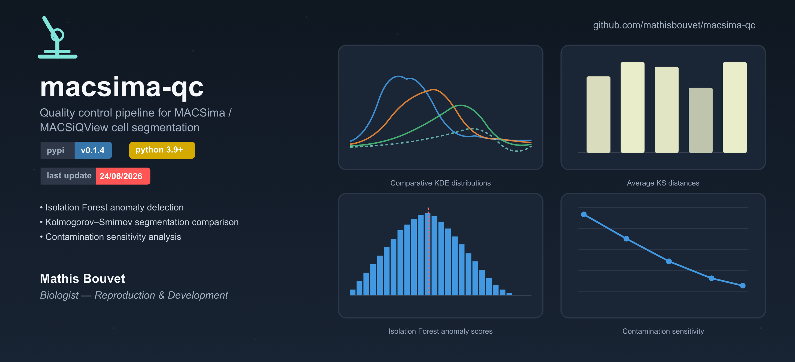
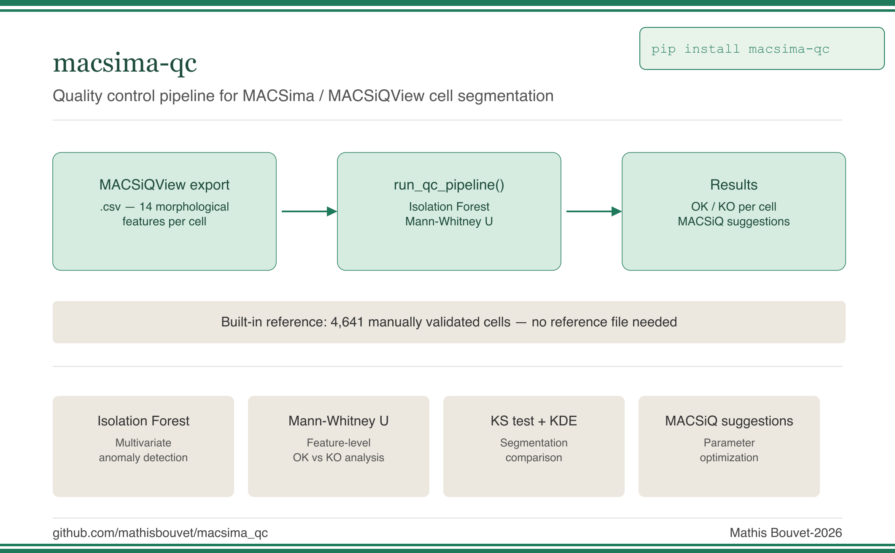
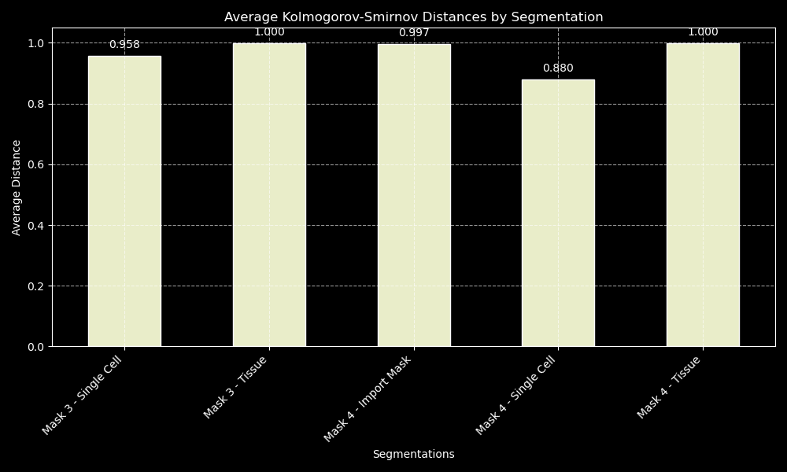
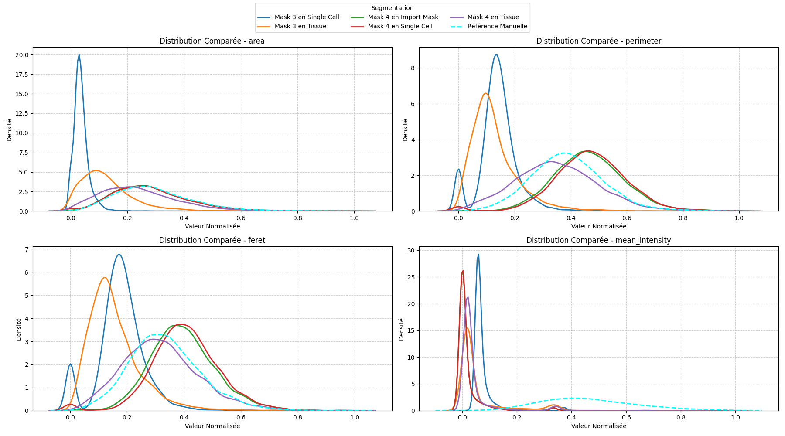

# macsima-qc
[](https://github.com/mathisbouvet/macsima-qc/actions/workflows/tests.yml)
[](https://pypi.org/project/macsima-qc/)
[](LICENSE)
[](https://www.python.org/downloads/)
[](https://pypi.org/project/macsima-qc/)

**Quality control pipeline for MACSima / MACSiQView cell segmentation**

Python package for evaluating and comparing cell segmentation results from the MACSima cyclic immunofluorescence platform, using manual ROI references from Fiji/ImageJ.




## Installation

```bash
pip install macsima-qc
```

Or from source (development mode):

```bash
git clone https://github.com/mathisbouvet/macsima-qc
cd macsima-qc
pip install -e .
```

---

<p align="center">

</p>


## Workflow

```
MACSiQView segmentation (.csv)
            │
    run_qc_pipeline()  ← Isolation Forest + Mann-Whitney
            │
    ┌───────┴────────────────────────┐
    │ segmentation_test_annotated.csv │  ← OK / KO labels per cell
    │ macsiq_param_suggestions.csv   │  ← MACSiQView adjustment suggestions
    └─────────────────────────────────┘

── Optional ──────────────────────────────────────────────
Fiji ROIs (.zip) ──► generate_masks() ──► run_comparison()  ← KS distances + KDE
```

---

## Quick start

### Minimal usage — built-in reference

No reference file needed. Just point to your MACSiQView segmentation CSV:

```python
from macsima_qc import run_qc_pipeline

df_annotated, df_suggestions = run_qc_pipeline(
    test_path="Segmentation_test.csv",
    contamination=0.10,
    output_dir="figures/",
)
```

### With a custom reference

If you want to use your own manually validated segmentation as reference:

```python
from macsima_qc import run_qc_pipeline

df_annotated, df_suggestions = run_qc_pipeline(
    test_path="Segmentation_test.csv",
    ref_path="my_reference.csv",
    contamination=0.10,
)
```

---

## 1. Exporting data from MACSiQView

### 1.a What data to export

After segmentation in MACSiQView, navigate to the **Feature Table** tab and select the following 14 morphological parameters for export. Only morphological descriptors are used — fluorescence intensities are excluded.

| Parameter | Description |
|-----------|-------------|
| `Cell Bbox X Size` | Bounding box width |
| `Cell Bbox Y Size` | Bounding box height |
| `Cell Shape Circle Like` | Circularity index |
| `Cell Shape Ellipse Like` | Ellipse similarity |
| `Cell Shape Elongation` | Elongation ratio |
| `Cell Shape Square Like` | Square similarity |
| `Cell Shape Triangle Like` | Triangle similarity |
| `Cell Size` | Cell area |
| `Nucleus Size` | Nucleus area |
| `Nucleus Roundness` | Nucleus roundness |
| `Nucleus Convexity` | Nucleus convexity |
| `Cell Convexity` | Cell convexity |
| `Quality Cell In-Focus` | Focus quality score |
| `Quality Nuclear Segmentation` | Nuclear segmentation quality |

> **These 14 features are mandatory.** The pipeline will raise an error if any are missing from the exported CSV.

### 1.b How to export

1. In MACSiQView, open the **Feature Table** panel
2. Select the 14 parameters listed above
3. Export as `.csv`
4. This exported file is your `test_path` input for `run_qc_pipeline()`

### 1.c About the built-in reference

The package ships with a built-in reference segmentation derived from a manually validated MACSima acquisition (DAPI channel, human embryonic tissue). It contains **4,641 cells** described by the same 14 morphological features listed above, exported using the exact same MACSiQView protocol.

> If your tissue type differs significantly from human embryonic tissue (e.g. non-embryonic tissue, very different cell density or morphology), consider providing your own reference via `ref_path`.

### 1.d QC pipeline — Isolation Forest

Before fixing the contamination parameter, the model sensitivity is analyzed across a range of values (0.01 → 0.20). The Isolation Forest is then trained exclusively on the reference data. Each test cell receives a label (`Segmentation_OK`: `1` or `-1`) and a continuous anomaly score.

The Mann-Whitney U test then compares OK vs KO distributions for each feature. When a statistically significant difference is found (p < 0.01), the direction of deviation is translated into an operational MACSiQView adjustment suggestion, exported to `macsiq_param_suggestions.csv`.


## Outputs

| File | Description |
|------|-------------|
| `mask_1–4.tif` | ROI masks for MACSiQView import |
| `figures/ks_average_distances.png` | KS distance barplot per segmentation |
| `figures/kde_comparative_distributions.png` | KDE distribution comparison |
| `figures/contamination_sensitivity.png` | Isolation Forest sensitivity curve |
| `figures/anomaly_scores_distribution.png` | Anomaly score histogram |
| `segmentation_test_annotated.csv` | Cells annotated OK/KO + anomaly score |
| `macsiq_param_suggestions.csv` | MACSiQView parameter adjustment suggestions |

<p align="center">

</p>

<p align="center"><em>Anomaly score distribution from the Isolation Forest — cells below the decision threshold are flagged as <code>Segmentation_KO</code>.</em></p>

## 2. Creating a reference segmentation *(optional)*

> For the full step-by-step protocol, see the [01_segmentation_qc](https://github.com/mathisbouvet/MACSima_Advanced-Spatial-Omics-Pipeline/blob/main/protocols/Test%20of%20segmentation.md).

A reference DAPI image is extracted from the MACSima system and exported in `.tif` format for processing in Fiji. Regions of interest (ROI) are manually drawn to serve as the basis for segmentation masks.

- **DAPI Image** : exported in `tiff` format via MACSima
- **RoiSet** : created and exported from Fiji in `zip` format

Once the ROIs are defined, four types of masks are generated and imported into MACSiQView as segmentation inputs:

| File | Description |
|------|-------------|
| `mask_1.tif` | ROIs with random colors, black background |
| `mask_2.tif` | ROIs with cyclic RGB colors (R/G/B), black background |
| `mask_3.tif` | ROIs in cumulative grayscale |
| `mask_4.tif` | ROIs in cumulative grayscale + black contours |


### 2a. Comparing segmentations

```python
from macsima_qc import run_comparison

distances = run_comparison(
    manual_path = "Segmentation_manuelle.csv",
    auto_paths  = [
        "Mask_3_Single_Cell.csv",
        "Mask_3_Tissue.csv",
        "Mask_4_Import_mask.csv",
        "Mask_4_Single_Cell.csv",
        "Mask_4_Tissue.csv",
    ],
    auto_names  = [
        "Mask 3 - Single Cell",
        "Mask 3 - Tissue",
        "Mask 4 - Import Mask",
        "Mask 4 - Single Cell",
        "Mask 4 - Tissue",
    ],
    output_dir = "figures/",
)
```

This produces a barplot of average KS distances and KDE distribution curves for the main morphological parameters, identifying the automatic segmentation closest to the manual reference.

<p align="center">

</p>

<p align="center">

</p>

<p align="center"><em>Lower KS distance = closer match to the manual reference. Here, <strong>Mask 4 – Single Cell</strong> performs best across most morphological parameters.</em></p>

---


## Requirements

- Python ≥ 3.9
- numpy, opencv-python, matplotlib, scikit-image, read-roi
- pandas, scikit-learn, scipy, seaborn

---

## Citation

If you use this package in a publication, please cite:

Bouvet M. (2026)

---

## License

MIT
